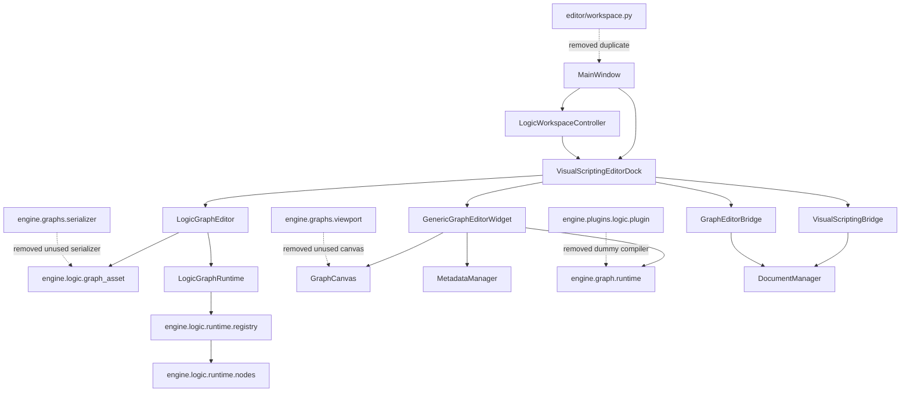

# Zennity Engine — Visual Logic Architecture Audit

Date: 2026-07-26  
Intent: `AUDIT_ANALYSIS` / `REFACTOR`  
Scope: Graph, Visual Scripting, Logic Graph, documents, workspaces and bridges.

## Executive decision

The production path is the specialized Visual Logic stack:

```text
MainWindow
  -> VisualScriptingEditorDock (the single graph hub)
  -> LogicGraphEditor (authoring workspace)
  -> engine.logic.graph_asset (schema, normalization, validation, persistence)
  -> LogicGraphRuntime
  -> engine.logic.runtime.registry
  -> engine.logic.runtime.nodes
```

`GenericGraphEditorWidget` and `engine.graph.runtime` remain shared infrastructure
for Behavior Tree, Dialogue and Material modes. They are not an alternative Logic
Graph implementation: they do not implement the `.zlogic` schema or the production
Logic runtime semantics.

The official user entry point is the graph hub. Specialized graph modes must be
opened as tabs in this hub; they must not add independent menu entries or windows.

## Dependency map



## Inventory

Legend:

- **Official**: active production path.
- **Infrastructure**: active shared primitive, not a competing Visual Logic stack.
- **Compatibility**: active only because tests/public imports still consume it.
- **Legacy removed**: no production consumer and removed in this audit.
- **Migration required**: active overlap that cannot be deleted without moving behavior.

### `editor/visual_scripting`

| Module | Responsibility | Consumers / dependencies | Classification | Removal |
|---|---|---|---|---|
| `visual_scripting_dock.py` | Single external graph hub; tabs, runtime controls and analysis panels | `MainWindow`, `LogicWorkspaceController`; depends on both editor families | **Official** | No |
| `mini_live_viewport.py` | Integrated game/runtime preview | graph hub and runtime tests | **Official: MiniGameView** | No |
| `runtime_visualization.py` | Runtime execution analysis rendering | mini viewport/tests | **Official: RuntimeAnalysis** | No |
| `runtime_explain_mode.py` | Explains active node/data flow | graph hub/tests | **Official: ExplainMode** | No |
| `runtime_timeline.py` | Execution timeline | graph hub/tests | **Official: Timeline** | No |
| `data_flow_animator.py` | Edge pulse/data-flow animation helper | explain/runtime UI | Infrastructure | No |
| `subgraphs_framework.py` | Subgraph authoring helper | tests and Visual Logic workflows | Infrastructure | No |
| `__init__.py` | Public editor API | importers | Official API surface | No |

### `editor/widgets/logic_graph` and `logic_graph_editor.py`

| Module | Responsibility | Consumers / dependencies | Classification | Removal |
|---|---|---|---|---|
| `logic_graph_editor.py` | Full `.zlogic` authoring workspace | graph hub, workspace builder, UI builders | **Official: VisualLogicWorkspace** | No |
| `ui_builder.py` | Builds palette/canvas/inspector/debugger UI | `LogicGraphEditor` | Official internal | No |
| `views.py` | Logic canvas and minimap views | runtime/canvas mixins | **Official Logic Graph canvas implementation** | No |
| `items.py` | Logic nodes, ports, edges, comments | views and mixins | Official Logic Graph items | No |
| `group_item.py` | Group/frame items | Logic editor | Official internal | No |
| `definitions.py` | Editor-side presentation definitions | Logic editor | Official internal | No |
| `item_geometry_mixin.py` | Node geometry behavior | `LogicNodeItem` | Official internal | No |
| `item_runtime_mixin.py` | Runtime state presentation | `LogicNodeItem` | Official internal | No |
| `help_dock.py` | Contextual help | Logic editor | Active auxiliary UI | No |
| `editor_mixins/*` | Palette, canvas, persistence, properties, runtime and blackboard responsibilities | `LogicGraphEditor` | Official internal decomposition | No |

### `editor/widgets/graph_editor` and `generic_graph_editor.py`

| Module | Responsibility | Consumers / dependencies | Classification | Removal |
|---|---|---|---|---|
| `generic_graph_editor.py` | Shared editor for Behavior Tree, Dialogue, Material and Animator tabs | graph hub and specialized docks | **Infrastructure**, not a second Logic editor | No |
| `graph_canvas.py` | Metadata-driven generic graph canvas | generic editor | Infrastructure | No |
| `node_item.py`, `port_item.py`, `edge_item.py` | Generic metadata graph presentation | generic canvas | Infrastructure | No |
| `comment_frame_item.py` | Generic comment frames | generic canvas/tests | Infrastructure | No |
| `inspector/graph_inspector.py` | Generic node inspector | generic editor | Infrastructure | No |
| `command_palette.py` | Main graph command palette | tests/generic flows | Migration required: overlaps `search/command_palette.py` | Not yet |
| `search/command_palette.py` | Search-specific command palette | generic search | Migration required | Not yet |
| `search/universal_search.py` | Generic node search | generic graph tools | Infrastructure | No |
| `documentation/*`, `docks/documentation_dock.py` | Generated node documentation UI | generic tools | Infrastructure | No |
| `docks/viewport_dock.py` | Generic dock wrapper | no production importer found | Removal candidate after UI smoke validation | Later |

The two canvas families are intentional today: the generic canvas consumes
`NodeDefinition` metadata, while the Logic canvas implements `.zlogic` groups,
comments, typed flow/data edges, breakpoints and live runtime state. Deleting either
without migrating those capabilities would be data loss, not consolidation.

### `engine/logic`

| Module | Responsibility | Consumers / dependencies | Classification | Removal |
|---|---|---|---|---|
| `graph_asset.py` | Canonical `.zlogic` schema and public persistence API | editor, scene hydration, runtime | **Official GraphSerializer facade** | No |
| `graph_normalizer.py` | Canonical normalization implementation | delegated by `graph_asset` | Official internal | No |
| `graph_validator.py` | Canonical semantic validation | delegated by `graph_asset` | Official internal | No |
| `node_definitions.py` | Canonical authoring definitions/ports | editor and schema | Official | No |
| `runtime/core.py` | Production event/data/flow runtime | viewport play commands | **Official VisualLogicRuntime** | No |
| `runtime/registry.py` | Runtime executor/evaluator handlers | runtime node modules/provider | **Official runtime NodeRegistry** | No |
| `runtime/nodes/*` | Concrete execution/evaluation handlers | runtime registry | Official executors | No |
| `runtime/debug.py`, `runtime/motion.py`, `runtime/output_evaluator.py` | Runtime responsibilities split from core | Logic runtime | Official internal | No |
| `provider.py` | Loads runtime handlers into metadata | engine boot path | Active, but boot logging must be cleaned | No |
| `blackboard.py`, `event_bus.py` | Runtime state and events | Logic runtime/editor | Official | No |
| `recipes.py`, `recipe_catalog*.py` | Authoring recipes | Logic editor | Official authoring support | No |
| `code_preview.py` | Node code explanation | Logic editor | Official authoring support | No |
| `logic_graph_type.py` | Broken unused Graph-framework adapter | imported nonexistent `engine.graphs.core.registry` | **Legacy removed** | Yes |

### `engine/graph`

| Module | Responsibility | Consumers / dependencies | Classification | Removal |
|---|---|---|---|---|
| `runtime/compiler.py` | Compiles metadata graphs into generic instructions | platform tests/generic graph modes | **Official GraphCompiler** | No |
| `runtime/executor.py` | Executes compiled generic instructions | platform tests/services | **Official GraphExecutor** | No |
| `runtime/node_runtime.py` | Runtime adapter contract | GraphExecutor | Official internal | No |
| `validation_service.py` | Shared generic graph validation | generic editors | Official infrastructure | No |

This runtime must not be called the Logic runtime. It is intentionally generic and
does not replace `LogicGraphRuntime`.

### `engine/graphs`

| Module/family | Responsibility | Consumers / dependencies | Classification | Removal |
|---|---|---|---|---|
| `core/{graph,node,pin,connection,pool}.py` | Metadata graph object model | plugins, tests, import adapter | Infrastructure | No |
| `registry/__init__.py` | Decorator registry of metadata node definitions | logic plugin nodes, generic canvas tests | Metadata **GraphRegistry**, not runtime NodeRegistry | No |
| `api.py` | Declarative graph/node decorators | package API | Migration required: overlaps registry decorator | Not yet |
| `plugins/*` | Metadata plugin discovery | engine graph package | Active infrastructure | No |
| `workspace/workspace_session.py` | List of graph IDs, no editor integration | no production importer found | Legacy candidate | Later |
| `runtime/debugger.py` | Generic debug trace | no production importer found | Legacy candidate | Later |
| `library/library_manager.py` | Graph export/import utility | package/tests | Auxiliary infrastructure | No |
| `logic_importer.py` | Adapter from legacy logic data to graph object model | framework migration | Temporary adapter | Remove only after schema migration |
| `core/serializer.py` | Serializes typed `Graph` objects | typed graph framework | Migration required; not equivalent to `.zlogic` serializer | Not yet |
| `serializer/*` | Second dict-based serializer with no consumers | none | **Legacy removed** | Yes |
| `viewport/*` | Third graph canvas with no consumers | none | **Legacy removed** | Yes |

### `engine/scripting`

| Module | Responsibility | Consumers / dependencies | Classification | Removal |
|---|---|---|---|---|
| `visual_scripting_nodes.py` | Five metadata nodes with `vs.*` IDs | `VisualScriptingProvider`, generic platform tests | **Compatibility** parallel to Logic definitions | Migrate |
| `provider.py` | Registers the five nodes and `.zscriptgraph` asset | tests/provider discovery | **Compatibility** | Migrate |
| `__init__.py` | Public compatibility API | tests | Compatibility | Remove after asset migration |

The `.zscriptgraph` provider is the clearest remaining parallel product path. It
must be migrated to `.zlogic` before deletion; no silent converter currently exists.

### Documents, workspaces and bridges

| Module | Responsibility | Classification | Decision |
|---|---|---|---|
| `editor/workspace/document_framework.py` | Shared typed document lifecycle | **Official DocumentManager** | Keep; introduce Visual Logic document policy here, not another manager |
| `editor/workspace/workspace_manager.py` | Qt panel/window presets | **Official WorkspaceManager** | Keep |
| `editor/workspace/layout_model.py` | Serializable, headless layout model | Official model, distinct responsibility | Keep |
| `editor/workspace.py` | Shadowed second workspace manager | **Legacy removed** | Removed |
| `editor/runtime/visual_scripting_bridge.py` | Logic hub/document/event integration | Official bridge owner | Keep |
| `editor/runtime/graph_editor_bridge.py` | Generic specialized-tab integration | Shared bridge implementation | Keep temporarily |
| `editor/runtime/graph_bridges.py` | Three factories for one generic bridge | Thin duplication | Migrate into one hub bridge |
| `editor/runtime/editor_bridge_orchestrator.py` | Owns lifecycle of all editor bridges | Official orchestration | Keep |

## Duplicate matrix

| Capability | Official | Duplicate / legacy | Required action |
|---|---|---|---|
| Visual Logic entry point | `VisualScriptingEditorDock` | old independent menu/dock paths | Already routed into one hub |
| Logic canvas | `LogicGraphView` + Logic items | `engine.graphs.viewport.GraphViewport` | Removed unused viewport |
| Generic canvas | `GraphCanvas` | Logic canvas is specialized, not replaceable yet | Define a shared scene protocol before merging |
| Node item | `LogicNodeItem` for `.zlogic`; `GraphNodeItem` for metadata graphs | no safe one-to-one replacement | Migrate presentation onto shared interfaces |
| Runtime | `LogicGraphRuntime` for `.zlogic`; `GraphExecutor` for compiled metadata graphs | naming suggests duplication | Rename contracts; compiler migration required |
| Executor registry | `engine.logic.runtime.registry.NodeRegistry` | `engine.graphs.registry.GraphRegistry` stores definitions, not executors | Keep roles but rename metadata registry |
| Serializer | `graph_asset.load/save_logic_graph` | unused dict serializer | Removed unused serializer; typed serializer remains |
| Document | `DocumentManager` | no second active manager | Keep |
| Workspace | package `editor.workspace` | `editor/workspace.py` | Removed shadowed module |
| Bridge | Visual scripting bridge plus configurable generic bridge | three factory functions | Merge factories into the hub bridge |
| Inspector | Logic properties mixin and generic graph inspector | capability overlap | Shared inspector protocol required |
| Search | Logic palette search and generic universal search; two command palettes | overlap | Consolidate after node-definition unification |
| Clipboard | Logic scene clipboard and placeholder generic clipboard | generic implementation incomplete | Move to shared graph command service |
| Compiler | generic `GraphCompiler`; Logic executes normalized graph directly | dummy logic compiler | Dummy compiler removed |

## Files removed in this audit

- `editor/workspace.py`
- `engine/graphs/serializer/__init__.py`
- `engine/graphs/serializer/universal_serializer.py`
- `engine/graphs/viewport/__init__.py`
- `engine/graphs/viewport/graph_viewport.py`
- `engine/plugins/logic/plugin.py`
- `engine/logic/logic_graph_type.py`

## APIs consolidated

- One user-facing graph hub.
- One Qt workspace manager.
- One document manager.
- One production `.zlogic` persistence facade.
- One production Logic runtime and runtime handler registry.
- One generic compiler/executor stack for metadata-based graph modes.

## Remaining migration risks

1. **Schema split — high:** `.zlogic` and `.zscriptgraph` identify different node IDs
   and asset contracts. Removing `engine.scripting` now would orphan those assets.
2. **Canvas split — high:** the Logic canvas owns functionality absent from the
   generic canvas. A shared `GraphCanvas` protocol must precede implementation merge.
3. **Runtime split — high:** the generic compiler does not encode Logic flow/data
   edges, events, subgraphs, breakpoints or persistent motion.
4. **Registry naming — medium:** `GraphRegistry` and `NodeRegistry` have different
   responsibilities but ambiguous names.
5. **Bridge overlap — medium:** four bridge objects attach to one hub. They should
   become one `VisualLogicBridge` with typed modes.
6. **Serializer overlap — medium:** typed `GraphSerializer` and `.zlogic` functions
   model different graphs; a versioned envelope is required before merging.
7. **Tests preserve compatibility — medium:** several tests assert Sprint-era public
   class names. Migration must update contracts rather than merely add aliases.

## Consolidation score

**74 / 100**

Rationale:

- Entry point, document lifecycle, active workspace and production Logic runtime are
  singular and verified.
- Seven dead/invalid modules were removed.
- The remaining gap is not dead code; it is an active schema/canvas/runtime split.
- A score above 90 requires asset conversion, a shared canvas protocol, one typed
  bridge and execution parity tests between authoring and runtime.

## Required next migration sequence

1. Define a versioned `VisualLogicDocument` envelope that can read `.zlogic`,
   `.zscriptgraph` and generic graph documents without losing node IDs.
2. Move the five `vs.*` definitions into the canonical Logic node catalog and ship an
   explicit asset converter.
3. Define shared canvas/node/port/edge protocols; port Logic-only behavior behind
   capabilities.
4. Make `GraphCompiler` compile canonical `.zlogic` into instructions with parity
   tests against `LogicGraphRuntime`.
5. Make `VisualLogicRuntime` the only runtime facade and keep the existing runtime as
   its interpreter backend until compiler parity reaches 100%.
6. Merge all graph bridge factories into one `VisualLogicBridge`.
7. Remove `engine.scripting`, the typed legacy importer, redundant command palette,
   unused workspace session and generic debugger after import scans and full tests.

